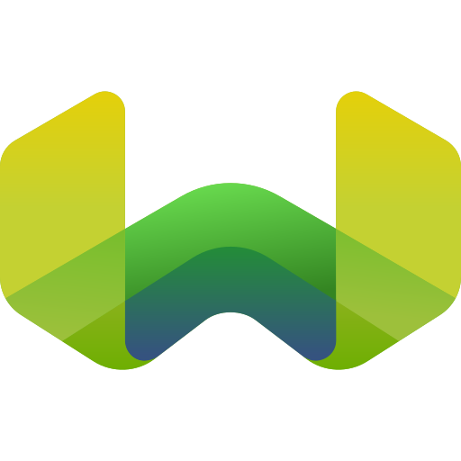

<h6 align="left">About Me</h6>

- 🎓 I'm a Computer Science student at *BITS Pilani*
- 👋 [my space](https://abhi-gupta.me)
- 🔭 I'm currently interning at [Pathnovo](https://pathnovo.com/) — AI agents that actually understand engineering documents
- 🌱 I'm currently learning **System Design, Distributed Systems**

 

<h6 align="center">Languages</h6>

&nbsp;&nbsp;
&nbsp;&nbsp;
&nbsp;&nbsp;
&nbsp;&nbsp;

  

<h6 align="center">LLM Providers & Platforms</h6>

&nbsp;&nbsp;
&nbsp;&nbsp;
&nbsp;&nbsp;
&nbsp;&nbsp;

  

<h6 align="center">Agentic AI & Orchestration</h6>

&nbsp;&nbsp;
&nbsp;&nbsp;
&nbsp;&nbsp;
&nbsp;&nbsp;

  

<h6 align="center">Vector DBs & Knowledge Graphs</h6>

&nbsp;&nbsp;
&nbsp;&nbsp;

  

<h6 align="center">Backend & Data</h6>

&nbsp;&nbsp;
&nbsp;&nbsp;
&nbsp;&nbsp;
&nbsp;&nbsp;

  

<h6 align="center">DevOps & Cloud</h6>

&nbsp;&nbsp;
&nbsp;&nbsp;
&nbsp;&nbsp;

 

<!-- 

  
  

 -->

<h6 align="center">Contributions Pacman</h6>

<picture>
  <source media="(prefers-color-scheme: dark)"
          srcset="https://raw.githubusercontent.com/AbhiGupta1310/AbhiGupta1310/output/pacman-contribution-graph-dark.svg">
  <source media="(prefers-color-scheme: light)"
          srcset="https://raw.githubusercontent.com/AbhiGupta1310/AbhiGupta1310/output/pacman-contribution-graph.svg">
  
</picture>

<h6 align="center">Let's Connect</h6>

&nbsp;&nbsp;
&nbsp;&nbsp;
&nbsp;&nbsp;

**Thanks for visiting! Star my repos if you find them helpful.**

