<div align="center">

# Abhi Gupta

[](https://git.io/typing-svg)


</div>

---


### 🚀 **About Me**

```python
class DataScientist:
    def __init__(self):
        self.name = "Abhi Gupta"
        self.role = "AI Engineer | Data Scientist"
        self.education = "Computer Science Student"
        self.interests = [
            "RAG Systems",
            "LLM Orchestration",
            "NLP & Transformers",
            "Vector Databases",
            "Model Context Protocol"
        ]

    def current_focus(self):
        return {
            "building": "Production RAG Pipelines",
            "learning": "LangGraph & Spacy",
            "exploring": "MCP-Style Context Control"
        }

    def future_goals(self):
        return "Applied AI Engineer solving real-world problems"
```

<br clear="both">

---

### 🎯 **What I'm Building**

<table>
<tr>
<td width="50%">

#### 🧠 **AI & Machine Learning**

- 🔍 **RAG Pipelines** - Document ingestion, vector search, context-aware responses
- 🤖 **NLP Systems** - Text processing, embeddings, transformer models
- 📊 **ML Models** - Classification, regression, feature engineering
- 🎨 **LLM Applications** - Prompt engineering, hallucination mitigation

</td>
<td width="50%">

#### ⚡ **Backend & Deployment**

- 🚀 **FastAPI Services** - RESTful APIs, Pydantic validation
- 🗄️ **Database Design** - SQL, NoSQL, vector databases
- 🔧 **Model Serving** - LLM APIs, MCP orchestration
- 📡 **Production Systems** - Scalable AI backends

</td>
</tr>
</table>

---

### 🛠️ **Tech Arsenal**

<details open>
<summary><b>💻 Languages & Core</b></summary>
<br>


</details>

<details open>
<summary><b>🧠 Data Science & ML</b></summary>
<br>


</details>

<details open>
<summary><b>🗣️ NLP & LLM Stack</b></summary>
<br>


</details>

<details open>
<summary><b>⚡ Backend & Frameworks</b></summary>
<br>


</details>

<details open>
<summary><b>🗄️ Databases</b></summary>
<br>


</details>

<details open>
<summary><b>🔧 Tools & Platform</b></summary>
<br>


</details>

---

### 📊 **GitHub Analytics**

<div align="center">
  
  
</div>

<div align="center">
  
</div>

---

### 📈 **Contribution Journey**

<div align="center">


<!--  -->

</div>

---

### **Contributions Pacman**

<picture>
  <source media="(prefers-color-scheme: dark)" 
          srcset="https://raw.githubusercontent.com/AbhiGupta1310/AbhiGupta1310/output/pacman-contribution-graph-dark.svg">
  <source media="(prefers-color-scheme: light)" 
          srcset="https://raw.githubusercontent.com/AbhiGupta1310/AbhiGupta1310/output/pacman-contribution-graph.svg">
  
</picture>
---

### 🧭 LLM Systems Engineering Path

_Building scalable RAG, agent-based, and cloud-native AI systems_

```mermaid
graph LR
    A[Python · ML · NLP] --> B[RAG Systems]
    B --> C[Vector Databases<br/>FAISS · Chroma · Pinecone]
    C --> D[AI Assistants & Chatbots]
    D --> E[AI Agents<br/>LangGraph · Tools · Memory]
    E --> F[Deep Learning & NLP<br/>spaCy · Transformers]
    F --> G[Scalable AI<br/>PySpark · Data Pipelines]
    G --> H[Cloud & Deployment<br/>FastAPI · GCP]
    H --> I[Open Source & Research]
    I --> J[AI Engineer / Applied Scientist]

    style A fill:#00f7ff,stroke:#00f7ff,color:#000
    style B fill:#00f7ff,stroke:#00f7ff,color:#000
    style C fill:#00f7ff,stroke:#00f7ff,color:#000
    style D fill:#00f7ff,stroke:#00f7ff,color:#000
    style E fill:#00f7ff,stroke:#00f7ff,color:#000
    style F fill:#00f7ff,stroke:#00f7ff,color:#000
    style G fill:#00f7ff,stroke:#00f7ff,color:#000
    style H fill:#00f7ff,stroke:#00f7ff,color:#000
    style I fill:#00f7ff,stroke:#00f7ff,color:#000
    style J fill:#ff006e,stroke:#ff006e,color:#fff

```



### ⚙️ What I’m Actively Engineering

- 🧠 Architecting **production-grade RAG systems** (retrieval, grounding, evaluation)
- 🧩 Designing **agent workflows with LangGraph** (tools, memory, control flow)
- 🗣️ Pushing **NLP beyond basics** using spaCy for real-world text pipelines
- 🚀 Shipping **end-to-end NLP APIs** with FastAPI (model → service → user)
- 🧬 Orchestrating **LLM context & tools** using MCP-style patterns

---

### 🌐 **Let's Connect!**

<div align="center">

[](https://www.linkedin.com/in/abhi-gupta-data-science/)
[](mailto:iamabhids@gmail.com)
[](#)

</div>

---

<div align="center">

### 💭 _"Analyzing today, Predicting tomorrow!"_


**⭐ Thanks for visiting! Star my repos if you find them helpful ⭐**


</div>
